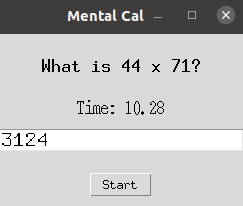
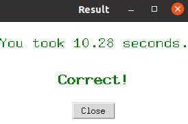

# Multiplication Game

Welcome to the **Multiplication Game**! This is a simple, interactive game where you can test your mental multiplication skills while racing against the clock.

## How to Play

1. **Click "Start"**: This will display the multiplication problem.
2. **Solve Mentally**: Multiply the two 2-digit numbers.
3. **Enter Your Answer**: Type the answer in the provided text box and press Enter.
4. **View Results**: After you press Enter, the timer stops, and you will get feedback on whether your answer was correct or incorrect.

## Screenshots

Here are the two main windows of the game:

1. **Initial Window**: Displays a prompt to click "Start" to begin the game.

   

2. **Game Window**: Displays the multiplication problem and the timer.

   

## Technologies Used

- **Python**: For the game logic and graphical user interface (GUI).
- **Tkinter**: For building the GUI, including labels, buttons, and input fields.
- **Random**: To generate random 2-digit numbers for each problem.
- **Time**: To handle the timer functionality.

## Installation

1. Clone the repository or download the files.
2. Make sure you have Python 3.x installed.
3. Run the game by executing the Python script:

   ```bash
   python game.py
